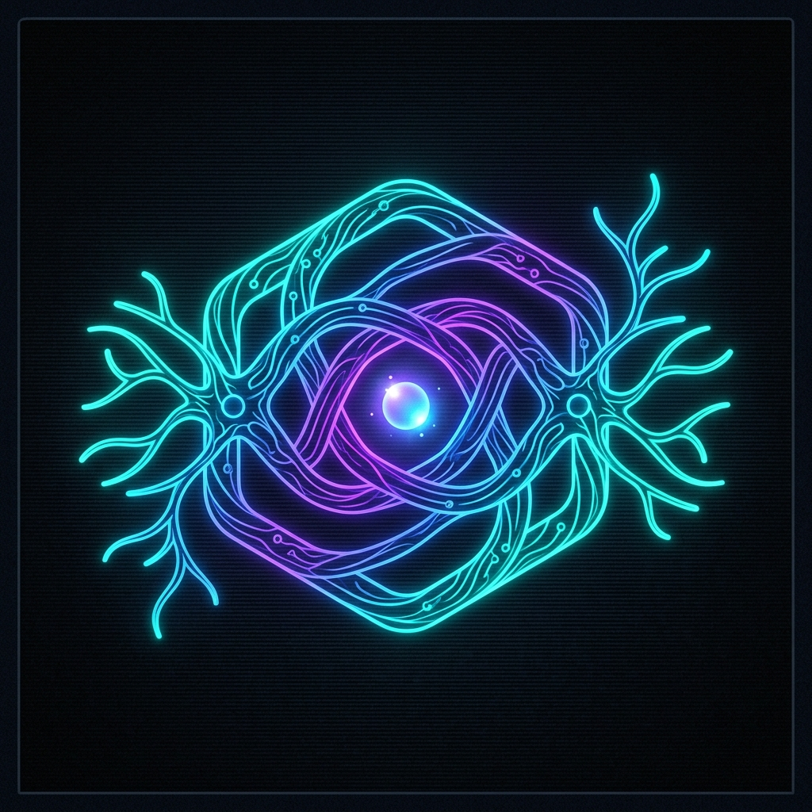

# Syntroph

<p align="center"></p>

<p align="center">
  <a href="https://github.com/mateusememe/syntroph/stargazers"></a>
  <a href="https://github.com/mateusememe/syntroph/commits/main/"></a>
  <a href="https://github.com/mateusememe/syntroph/actions"></a>
  <a href="https://github.com/mateusememe/syntroph/blob/main/LICENSE"></a>
  
</p>

Syntroph is a Go toolkit and orchestrator that connects open-source development tools around a hexagonal (Ports & Adapters) core. Its event bus models syntrophy: one adapter's metabolic residue becomes another adapter's useful input.

> **Status:** architecture and domain contracts are being shaped. The repository currently contains design documents and no released CLI binary yet.

## Design

- Go hexagonal core, synchronous in-process Event Bus, and append-only Saga Journal.
- MVP: MemoryPort + GraphPort with canonical local storage under `.syntroph/memory/`.
- GitHub Wiki or Issues as StoragePort mirrors, with exactly one explicit `github-rest`, `github-mcp`, or `github-wiki-git` provider.
- Claude Code, Codex, and Antigravity CLI runtimes. KiroCrew is design inspiration only.
- Explicit recovery with `sync status`, `sync recovery`, `sync retry`, and conflict resolution.

See [CONTEXT.md](CONTEXT.md), [architecture decisions](docs/adr/), and [brainstorm-syntroph.md](brainstorm-syntroph.md).

## Usage (target CLI)

```sh
syntroph session close --artifact session.md --repository owner/name --commit <sha>
syntroph doctor storage
syntroph sync status
syntroph sync recovery
syntroph sync retry --graph
syntroph sync resolve <id> --keep-local
```

Session artifacts are structured Markdown or JSON. A manual `--summary` fallback is supported; raw transcript capture is outside the MVP.

Repository configuration uses `.syntroph/config.yaml` exclusively. Run `syntroph doctor storage` after cloning to validate the selected provider, normalized destination, and local prerequisites without authenticating or writing remotely. See [Installation](INSTALL.md#github-mirroring) for safe examples.

The `github-mcp` Issues provider uses one explicitly configured stdio process per Syntroph operation. Its server must own non-interactive authentication and expose both the `issues` and `labels` toolsets; Syntroph validates the complete tool schema before any remote write.

## Selected engineering skills

Syntroph tracks `code-review`, `codebase-design`, `diagnosing-bugs`, `domain-modeling`, `grill-me`, `grill-with-docs`, `grilling`, `implement`, `improve-codebase-architecture`, `research`, `tdd`, `to-spec`, `to-tickets`, `triage`, `wait-what`, and `implement-spec` from [`mattpocock/skills`](https://github.com/mattpocock/skills).

```sh
npx skills@latest add mattpocock/skills
```

Selected paths and integrity hashes are recorded in [skills-lock.json](skills-lock.json).

## Documentation

- [Installation](INSTALL.md)
- [Contributing](CONTRIBUTING.md)
- [Domain glossary](CONTEXT.md)
- [Architecture decisions](docs/adr/)

## License

Syntroph uses the [Syntroph Non-Commercial License](LICENSE): it may be used, studied, modified, and shared for non-commercial purposes, but must not be sold or offered as a paid service. Third-party adapters retain their own licenses.
