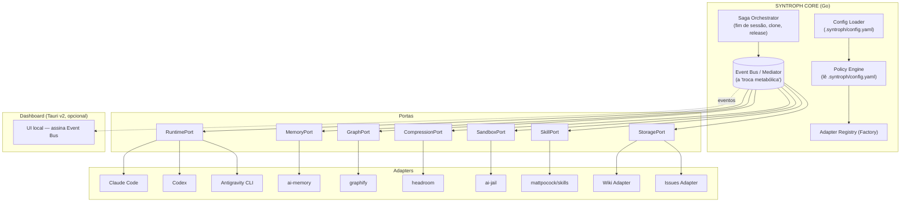

# SYNTROPH — Documento de Contexto e Arquitetura (v3)

> Estado: brainstorming fechado nos pontos abaixo. Nenhuma linha de código ainda.
> Este documento foi escrito para ser colado inteiro em uma nova conversa com LLM como contexto de partida.

---

## 0. Checklist de decisões já fechadas

- [x] Nome: **Syntroph** (conceito: Sintrofia — ver seção 1)
- [x] Arquitetura: Hexagonal (Ports & Adapters) + padrões adicionais (seção 3)
- [x] Linguagem do núcleo/orquestrador: **Go**
- [x] Solução do "post-clone hook": comando próprio `syntroph clone`
- [x] Config: pasta `.syntroph/`, YAML, wizard interativo no CLI
- [x] Backend de memória: **configurável** entre Wiki do GitHub OU Issues do GitHub, ambos via template Obsidian-style
- [x] Grafo do graphify: branch órfã separada + regra explícita para qualquer LLM/agente seguir
- [x] Contract tests + versionamento próprio com pin explícito de versões de cada adapter por release
- [x] Dashboard local via Tauri v2 + Event Hub + Saga pattern explícito
- [x] CI/CD de release automatizado para a aba Releases do GitHub
- [x] Prompt de logo cyberpunk/dark futurism
- [x] Landing page via GitHub Pages
- [x] **Runtimes iniciais (RuntimePort): Claude Code, Codex, Antigravity CLI** — KiroCrew foi só referência de arquitetura de gateway, não é dependência
- [x] **Par de adapters do MVP recomendado: MemoryPort + GraphPort** (ver seção 15)

---

## 1. Nome: Syntroph

Pesquisei agora — **"syntroph" está livre**, sem colisão relevante no GitHub (só nomes parecidos e não relacionados, tipo "syntroy" e "Syntro", que é outra coisa).

**Por que o conceito é mais preciso que o anterior (Cypher/CypherEvo):** sintrofia, em biologia/ecologia, é uma relação de simbiose obrigatória onde o **resíduo metabólico de um organismo é o alimento do outro** — nenhum dos dois sobrevive sozinho fazendo essa troca completa. É uma descrição quase literal do que o Event Bus faz aqui: o *output* de um adapter (ex: uma sessão de código gerando uma decisão) vira o *input* nutritivo de outro (ex: essa decisão virando página de memória, que por sua vez enriquece uma consulta futura no grafo). Não é só "comunicação entre módulos" — é dependência mútua produtiva.

- Nome do produto: **Syntroph**
- Binário CLI: `syntroph`
- Pasta de config: `.syntroph/`
- Conceito/tagline: **Sintrofia** — "o resíduo de um agente é o alimento do próximo"

---

## 2. Repositórios de referência (a "matéria-prima")

| Ferramenta | Repositório | Papel no Syntroph |
|---|---|---|
| KiroCrew | `kirodotdev/KiroCrew` | **Referência de arquitetura** (gateway multi-superfície, scheduler, subagents) — inspiração de design, não é dependência nem adapter de runtime |
| mattpocock/skills | `mattpocock/skills` | Conteúdo do `SkillPort` — grill-me, to-spec, tdd, code-review, domain-modeling, wayfinder |
| ai-memory | `akitaonrails/ai-memory` | Referência de design para `MemoryPort` (wiki compilado, handoff cross-agent) |
| ai-jail | `akitaonrails/ai-jail` | Adapter de `SandboxPort` (bubblewrap/Landlock/seccomp no Linux, sandbox-exec no macOS) |
| headroom | `headroomlabs-ai/headroom` | Adapter de `CompressionPort` (proxy de compressão de tokens) |
| graphify | `Graphify-Labs/graphify` | Adapter de `GraphPort` (grafo de código via tree-sitter, sem vetor) |

### Runtimes (RuntimePort) — decisão desta rodada

KiroCrew foi só exemplo de gateway, **não** é a base do RuntimePort. Os backends de runtime iniciais são:

- **Claude Code**
- **Codex**
- **Antigravity CLI** (Google Antigravity — já aparece como agente suportado tanto no `ai-memory` quanto no `graphify`, então já existe precedente de integração nos dois repositórios de referência)

Cada um vira uma implementação de `RuntimePort` via **Strategy pattern**, selecionável em `.syntroph/config.yaml`.

---

## 3. Arquitetura: Hexagonal + padrões consolidados



### Padrões usados (e por quê)

| Padrão | Aplicação |
|---|---|
| **Hexagonal / Ports & Adapters** | Núcleo isolado dos adapters externos |
| **Mediator / Event Bus** | A "troca sintrófica": nenhum adapter fala com outro diretamente, tudo passa pelo barramento |
| **Saga (orquestrada, não coreografada)** | Pipelines multi-passo com possível falha parcial: fim de sessão, `syntroph clone`, release. Orquestrada de propósito — visibilidade centralizada no dashboard |
| **Strategy** | Escolha de runtime (Claude Code / Codex / Antigravity CLI) e de backend de armazenamento (Wiki vs Issues) em tempo de execução |
| **Factory / Registry** | `Adapter Registry` instancia só os adapters habilitados no config |
| **Repository** | `StoragePort` abstrai "onde a página de memória mora" — Wiki e Issues como duas implementações do mesmo contrato |
| **Command** | Cada invocação de skill vira um comando auditável (log + possível replay) |
| **Circuit Breaker** | Em torno do `CompressionPort` — se cair, falha aberto (bypassa compressão) em vez de travar o agente |
| **Content-addressed storage** | Cache do grafo e páginas de memória, via SHA do git |
| **CQRS (leve)** | Dashboard lê um projection do Event Bus (read model), nunca escreve direto nos adapters — só o Core escreve |

---

## 4. Sistema de configuração

- Pasta `.syntroph/` criada no primeiro `syntroph clone` ou `syntroph init`.
- `syntroph config` abre um **wizard interativo** que gera/atualiza `.syntroph/config.yaml`.
- Todo adapter é **ligável/desligável individualmente**:

```yaml
version: 1
adapters:
  runtime:
    enabled: true
    backend: claude-code   # claude-code | codex | antigravity-cli
  memory:
    enabled: true
    backend: ai-memory
  graph:
    enabled: true
    backend: graphify
    branch: syntroph/graph-cache
  compression:
    enabled: false
    backend: headroom
  sandbox:
    enabled: true
    backend: ai-jail
    mode: standard      # standard | strict | off
  skills:
    enabled: true
    source: mattpocock/skills
storage:
  backend: wiki          # wiki | issues
  template: .syntroph/templates/memory-page.md
```

- Um `config-baseline.yaml` (default) vem junto do binário e é copiado pra `.syntroph/` no primeiro clone.

---

## 5. Backend de memória: Wiki **ou** Issues (plugável), template Obsidian-style

### Limites reais do GitHub Wiki (pesquisados)

- Máximo prático de **~5.000 arquivos** por wiki.
- Página individual: limite prático de **~484.000 caracteres** (~0.5 MB).
- A wiki é, por baixo, **um repositório git normal** (`repo.wiki.git`) — valem os limites gerais de repositório do GitHub.
- **Sem busca full-text nativa** e **sem navegação aninhada real** — sidebar mantida manualmente. Se precisarmos de busca de verdade, indexar localmente (ex: FTS5, como o próprio ai-memory faz).
- Aguenta numa boa o volume de páginas de memória compilada; não é onde o `graph.json` deveria ir (daí a branch separada, seção 6).

### Backend alternativo: Issues

Metadados nativos (labels, assignee, data), pesquisável via API, comentários como histórico de revisão natural, pode ser fechada/reaberta como estado. Não renderiza `[[wikilinks]]` de forma clicável nativamente — backlinks ficam como texto pesquisável, a menos que o dashboard resolva isso.

### `StoragePort` — contrato único, dois adapters

Template comum em `.syntroph/templates/memory-page.md`, estilo Obsidian:

```markdown
---
title: "{{titulo}}"
date: {{data-iso}}
authors: [{{autor}}]
labels: [{{tag1}}, {{tag2}}]
source_session: {{session-id}}
related: ["[[{{pagina-relacionada}}]]"]
---

## Contexto
{{resumo}}

## Decisões
{{decisoes}}

## Lições
{{licoes}}

## Referências
- [[{{outra-pagina}}]]
```

Na **Wiki**: `[[wikilinks]]` funcionam nativamente. Nas **Issues**: `related` vira `#123`, labels viram labels reais; wikilinks ficam como texto pesquisável.

---

## 6. Grafo do graphify: branch órfã + regra para as LLMs seguirem

- Branch dedicada, ex: `syntroph/graph-cache` — órfã e reescrita a cada atualização.
- Fluxo: `graphify --update` → `syntroph graph push` → force-push nessa branch.
- Regra injetada em `AGENTS.md`/`CLAUDE.md`/`GEMINI.md` via bloco marcado (`<!-- syntroph:start -->...<!-- syntroph:end -->`), instruindo qualquer runtime (Claude Code, Codex, Antigravity CLI) a rodar `syntroph graph push` após atualizar o grafo, nunca commitando `graph.json` direto na branch de trabalho.

---

## 7. Versionamento e contract tests

- Semver próprio (`v0.1.0`...), independente das ferramentas integradas.
- `ADAPTER_VERSIONS.lock` por release:

```
akitaonrails/ai-memory     = vA.B.C
akitaonrails/ai-jail       = vD.E.F
headroomlabs-ai/headroom   = vG.H.I
Graphify-Labs/graphify     = vJ.K.L
mattpocock/skills          = <tag ou commit>
```

- **Contract tests** no CI antes de qualquer release, testando o *contrato* de cada Port, não o comportamento interno da ferramenta.

---

## 8. Sobre "números de marketing" (nota mantida da v2)

Números como "60–95% menos tokens" (headroom) ou tabelas tipo LOCOMO (graphify) são auto-reportados pelos próprios projetos. Não usar como premissa de arquitetura/dimensionamento sem reproduzir com benchmark próprio em 2–3 repositórios reais nossos primeiro.

---

## 9. Dashboard local (Tauri v2) + Event Hub + Saga

- Tauri v2: shell nativo (Rust) + webview, 100% local, sem servidor exposto por padrão.
- Cliente do Event Bus do Core (Go) via IPC/WebSocket local — não é um segundo backend.
- Eventos exibidos: sessão iniciada/encerrada, página de memória compilada, grafo atualizado + push feito, tokens economizados, execuções de sandbox, skills invocadas, passos de saga concluídos/falhos.
- Saga visível como máquina de estados no dashboard — facilita depurar falhas parciais sem vasculhar log cru.

---

## 10. CI/CD de release

- GitHub Actions disparado em merge de PR pra `main`.
- Contract tests → build cross-platform (goreleaser) → changelog automático → tag semver → publica artefatos na aba **Releases**.

---

## 11. Prompt de logo — dark futurism / cyberpunk

> "A minimalist emblem logo for a developer tool called 'Syntroph', dark cyberpunk aesthetic, deep black background with a bioluminescent cyan-to-violet gradient motif of two intertwined organic circuit-forms exchanging a glowing particle between them — like mycelial threads or synaptic filaments feeding each other, forming a subtle hexagon silhouette where they meet. Neon wireframe style, thin glowing lines, subtle scanline texture, high contrast, no text, flat vector logo, centered composition, inspired by Blade Runner and Annihilation's bio-organic sci-fi aesthetic, suitable for a terminal/CLI app icon."

Variação alternativa (mais abstrata/técnica):

> "Geometric tech logo, dark bio-futurism, two interlocking node-graph shapes exchanging a single glowing point of light at their intersection, cyan and violet neon against pure black, thin glitch-line accents, vector flat design, symbiosis/network motif, no text, app-icon composition."

---

## 12. Landing page (GitHub Pages)

- `gh-pages` branch ou `/docs`, mesma lógica de branch dedicada do grafo.
- Tema visual: paleta do logo (preto + neon ciano/violeta).
- Seções: hero (nome + tagline "Sintrofia entre agentes"), diagrama da arquitetura hexagonal, showcase dos adapters (com crédito aos repositórios originais), quickstart (`syntroph clone`), link pro repo.

---

## 13. Contratos das portas (rascunho conceitual — Go, ainda não final)

```go
type RuntimePort interface {
    StartSession(ctx context.Context, spec TaskSpec) (SessionHandle, error)
    StreamEvents(SessionHandle) (<-chan AgentEvent, error)
    EndSession(SessionHandle) error
}

type MemoryPort interface {
    Compile(session SessionHandle) (MemoryPage, error)
    Query(q string) ([]MemoryPage, error)
    Handoff(next SessionHandle) error
}

type GraphPort interface {
    Update(repoPath string) (GraphSnapshot, error)
    Query(question string) (Subgraph, error)
    PushToBranch(branch string) error
}

type CompressionPort interface {
    Compress(payload []byte, kind ContentKind) ([]byte, Stats, error)
}

type SandboxPort interface {
    Wrap(cmd Command, policy SandboxPolicy) (Command, error)
    Teardown(handle SandboxHandle) error
}

type SkillPort interface {
    Invoke(name string, args map[string]any) (SkillResult, error)
    List() []SkillDescriptor
}

type StoragePort interface {
    Save(page MemoryPage) (Ref, error)
    Fetch(ref Ref) (MemoryPage, error)
    Backend() string // "wiki" | "issues"
}
```

---

## 14. Próximos adapters / evoluções futuras (não-MVP)

- `GraphDBPort` opcional (graphify já suporta push pra Neo4j/FalkorDB)
- Adapter de billing/alerta de custo, consumindo eventos de `CompressionPort`
- Backend de memória adicional além de Wiki/Issues
- `SandboxPort` (ai-jail) e `CompressionPort` (headroom) como segunda onda — ver seção 15

---

## 15. Recomendação de MVP: qual par de adapters começar

**RuntimePort não conta como "um adapter opcional"** — é o substrato mínimo: sem ele não há sessão pra orquestrar. Ele já entra com 3 backends (Claude Code, Codex, Antigravity CLI) via Strategy, decisão já fechada.

A pergunta real é: dado o RuntimePort funcionando, **quais dois adapters funcionais entram primeiro?**

### Recomendação: `MemoryPort` + `GraphPort`

Motivos:

1. **É o par que prova a tese do nome.** Sintrofia exige uma troca de mão dupla real, não só "dois módulos rodando em paralelo". Memory e Graph se alimentam mutuamente de forma natural: o `GraphPort` fornece fatos estruturais do código (o que chama o quê, comunidades, god nodes) que enriquecem o que o `MemoryPort` compila como "decisão" ou "lição"; e o `MemoryPort`, por sua vez, pode anotar nós do grafo com contexto histórico ("essa função foi refatorada por causa de X"). Isso já é bem próximo do que o próprio graphify faz internamente com seu `reflect`/overlay de lições (`graphify reflect`, tags "preferred/tentative/contested" nos nós) — ou seja, **já existe precedente real disso funcionando** num dos nossos repositórios de origem, o que reduz risco de a ideia não se sustentar na prática.
2. **Menor superfície de risco técnico pro primeiro milestone.** Nenhum dos dois exige processo de sandboxing nem proxy de rede (ao contrário de `SandboxPort`/`CompressionPort`, que envolvem infra própria rodando ao lado). São mais fáceis de testar em contract tests isolados.
3. **Validam o `StoragePort` de graça.** O `MemoryPort` já depende do `StoragePort` (Wiki/Issues) pra existir — então esse par testa três portas (Memory, Graph, Storage) com o esforço de implementar duas.

### Terceiro adapter forte pra logo depois (não é obrigatório no MVP, mas é o mais barato de adicionar em seguida)

**`SkillPort`** (mattpocock/skills) — é só conteúdo markdown, **sem dependência de binário externo**, então o custo de integração é baixíssimo comparado aos outros. E ele é o que gera a "matéria bruta" que o `MemoryPort` compila (uma sessão de `/grill-me` → `/to-spec` → `/tdd` → `/code-review` produz decisões concretas — sem isso, o `MemoryPort` fica compilando sessões pobres em conteúdo). Recomendo: **MVP = Memory + Graph, com Skill entrando na sequência imediata (não como fase 2 distante).**

`SandboxPort` (ai-jail) e `CompressionPort` (headroom) ficam pra depois — são infraestrutura de middleware (envolvem toda chamada), valiosas mas não "simbióticas" entre si da mesma forma; fazem mais sentido como uma segunda onda, depois que o event bus e a saga já estiverem provados com o primeiro par.

---

## 16. Bloco de handoff — cole isto no início de uma nova conversa com LLM

```
Projeto: Syntroph — toolkit/orquestrador que integra ferramentas open source
em torno de um núcleo hexagonal (Ports & Adapters) escrito em Go. Conceito:
sintrofia (simbiose biológica onde o resíduo metabólico de um organismo
alimenta o outro) — mapeado pro Event Bus, onde o output de um adapter
nutre os outros.

Repos de origem (referência de design, não somos fork):
- kirodotdev/KiroCrew — referência de arquitetura de gateway (NÃO é
  dependência de runtime, foi só inspiração inicial)
- mattpocock/skills — metodologia: grill-me, to-spec, tdd, code-review,
  domain-modeling (fonte do SkillPort)
- akitaonrails/ai-memory — referência de memória compilada cross-agent
  (fonte de design do MemoryPort)
- akitaonrails/ai-jail — sandbox de SO (fonte do SandboxPort)
- headroomlabs-ai/headroom — compressão de tokens, proxy (fonte do
  CompressionPort)
- Graphify-Labs/graphify — grafo de código via AST/tree-sitter, sem vetor
  (fonte do GraphPort)

Decisões fechadas:
- Nome: Syntroph (pasta de config: .syntroph/, binário: syntroph).
  Verificado sem colisão relevante no GitHub.
- Arquitetura: Hexagonal / Ports & Adapters, Event Bus (Mediator) como a
  "troca metabólica" entre adapters, Saga orquestrada (não coreografada)
  para pipelines multi-passo (fim de sessão, clone, release), Strategy
  para runtime e storage backend, Repository pattern para StoragePort,
  Factory/Registry para instanciar só adapters habilitados, Circuit
  Breaker no CompressionPort, CQRS leve entre Core (write) e Dashboard
  (read).
- Linguagem do núcleo: Go.
- Portas: RuntimePort, MemoryPort, GraphPort, CompressionPort,
  SandboxPort, SkillPort, StoragePort.
- RuntimePort — backends iniciais: Claude Code, Codex, Antigravity CLI
  (via Strategy pattern). KiroCrew NÃO é dependência de runtime.
- MVP recomendado: MemoryPort + GraphPort como primeiro par funcional
  (justificativa: já existe precedente real dessa troca simbiótica no
  próprio graphify via seu recurso `reflect`/overlay de lições; menor
  superfície de risco por não envolver sandboxing/proxy; testa de graça
  o StoragePort). SkillPort recomendado como próxima adição imediata
  (custo baixo, é só markdown, e é o que gera conteúdo rico pro
  MemoryPort compilar). SandboxPort e CompressionPort ficam pra uma
  segunda onda.
- Problema do post-clone hook (git não tem esse hook nativo) resolvido
  com comando próprio `syntroph clone`.
- Memória: backend plugável entre GitHub Wiki e GitHub Issues
  (StoragePort), template Obsidian-style comum (frontmatter: title,
  date, authors, labels, related [[wikilinks]]), em
  .syntroph/templates/. Limites da Wiki pesquisados: ~5.000 arquivos,
  ~484.000 caracteres/página, sem busca full-text nativa, é git repo
  normal por baixo (repo.wiki.git).
- Grafo do graphify: branch órfã dedicada (syntroph/graph-cache),
  reescrita a cada push. Regra injetada em AGENTS.md/CLAUDE.md/GEMINI.md
  via bloco marcado, instruindo qualquer runtime a rodar
  `syntroph graph push` após atualizar o grafo.
- Versionamento: semver próprio + ADAPTER_VERSIONS.lock fixando versão
  exata testada de cada dependência externa por release, validado por
  contract tests no CI.
- Cautela: benchmarks divulgados por headroom/graphify são
  auto-reportados — não usar como premissa de arquitetura sem
  reproduzir com benchmark próprio.
- Dashboard: Tauri v2 local, cliente do Event Bus do Core (não é um
  segundo backend), mostra métricas por repo e estado da Saga em tempo
  real.
- CI/CD: goreleaser + GitHub Actions, dispara em merge pra main, publica
  binários na aba Releases.
- Identidade visual: cyberpunk/bio-futurismo (preto + neon
  ciano/violeta), prompts de logo redigidos no documento fonte.
- Landing page: GitHub Pages.

Contratos de porta (rascunho conceitual em Go) na seção 13 do documento
fonte "brainstorm-toolkit-evo.md" — ponto de partida pra desenho de
interface, não implementação final.

Ainda em aberto: desenho fino de cada assinatura de porta, ordem exata
de implementação dentro do par Memory+Graph, decisão de como o
SkillPort injeta conteúdo no MemoryPort na prática.
```
